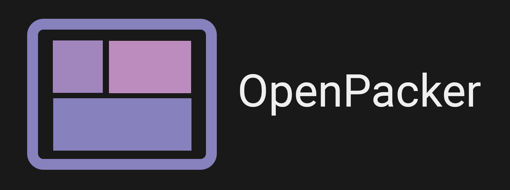

_Logo by [razzie-dev](https://github.com/razzie-dev)_

OpenPacker is a texture packing tool to create optimized spritesheets and texture atlases from a collection of images.

This project is forked from [free-tex-packer](https://github.com/odrick/free-tex-packer/releases).

# Features
* Sprite rotation
* Trimming
* Various export formats
  * Pixi.js 
  * CSS
  * Godot
  * Phaser
  * Cocos2d
* Spritesheet Splitter
* Free, forever

# Usage

Either drag and drop images or use the "add images" button that will be included in your atlas. They should begin to appear in the center as a preview of your atlas.

Configure your output using one of the fields in the right panel. These changes will also be reflected in the preview.

Click "Export" when you're satisfied with the atlas. Use the Format dropdown to alter the export format based on how you will be using the atlas.
